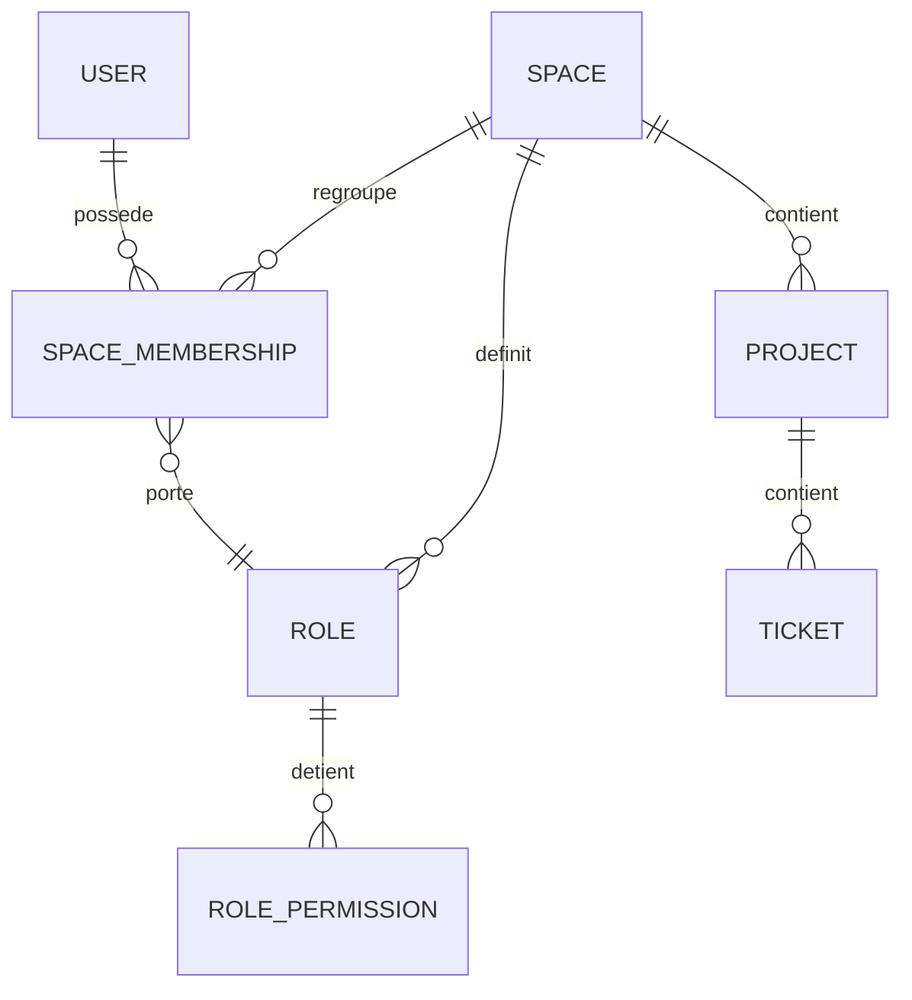
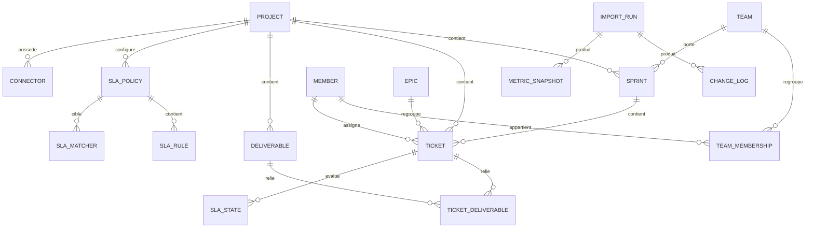
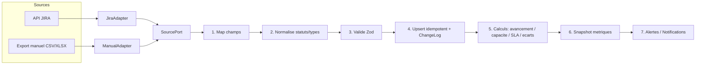
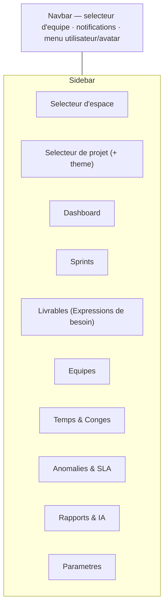

# ONEEO — Note de cadrage technique

> Réponse à la spécification : arbitrages, choix technologiques, modèle d'identité/espaces, architecture SI agnostique et découpage des pages.
> Objectif : converger vers un **MVP** livrable rapidement, sur une stack légère, avec un socle qui tient pour la suite (historisation, IA, multi-espaces, open source).
>
> _Version 2 — intègre les arbitrages tranchés (auth, espaces, objectif de sprint, SLA, timesheet)._

---

## 1. Synthèse des décisions (TL;DR)

| Sujet                | Décision                                             | En une phrase                                                                                     |
| -------------------- | ---------------------------------------------------- | ------------------------------------------------------------------------------------------------- |
| Framework            | **Nuxt 4** (plutôt que SvelteKit)                    | Nitro fournit nativement les **tâches planifiées** (imports périodiques + rapports), central ici. |
| CSS / UI             | **DaisyUI 5 + Tailwind CSS 4** (imposé)              | Thème par projet via `@plugin "daisyui/theme"`, config 100 % en CSS.                              |
| Graphes              | **ApexCharts** (imposé)                              | Wrapper `vue3-apexcharts`, rendu _client-only_, thème synchronisé sur les variables DaisyUI.      |
| Base de données      | **SQLite + Drizzle ORM** (`better-sqlite3`)          | Léger, typé, migration Postgres possible sans réécrire le domaine.                                |
| Jobs planifiés       | **Nitro scheduled tasks**                            | Imports périodiques + rapports, sans cron externe.                                                |
| Identité / tenancy   | **User → Space → Project** + RBAC scopé espace       | Un espace = une entreprise ; rôles à nom libre + permissions cochables.                           |
| Authentification     | **`nuxt-auth-utils`** (sessions cookie)              | Léger, setup admin au premier lancement, invitations par email.                                   |
| Validation / imports | **Zod**                                              | Contrôles de format sur imports manuels + typage des payloads API.                                |
| IA / LLM             | **SDK Anthropic (Claude)** derrière un port abstrait | Un seul fournisseur au début, interface prête pour d'autres.                                      |
| Mail                 | **Nodemailer (SMTP)** — phase 3                      | Envoi manuel puis automatique des comptes rendus.                                                 |
| Architecture         | **Hexagonale (ports & adapters)**                    | JIRA devient un simple _adapter_ ; le cœur métier est agnostique de l'outil source.               |

---

## 2. Points clarifiés (arbitrages tranchés)

| #   | Point                               | Décision retenue                                                                                                                                                    |
| --- | ----------------------------------- | ------------------------------------------------------------------------------------------------------------------------------------------------------------------- |
| 1   | Framework                           | **Nuxt 4** (cf. §3). Bascule SvelteKit possible si l'équipe est déjà fluente en Svelte.                                                                             |
| 2   | « LA de certains types de tickets » | **= SLA**. Aucune nouvelle entité, renforce la fonctionnalité SLA.                                                                                                  |
| 3   | Comptes & permissions               | Admin au premier lancement, RBAC scopé espace (cf. §4). En MVP tout le monde peut tout faire ; l'écran de gestion des rôles arrive post-MVP.                        |
| 4   | Espaces (tenancy)                   | Hiérarchie **User → Space (entreprise) → Project** (cf. §4). Une instance peut héberger 1..N espaces.                                                               |
| 5   | « Read-only »                       | Modèle **en 2 couches** : canonique importée (jamais éditée) vs augmentation locale (éditable).                                                                     |
| 6   | Avancement d'une EPIC               | Moyenne du % des tickets (conforme spec). Méthode _simple / pondérée par charge_ configurable en V1.1.                                                              |
| 7   | Avancement d'un sprint              | Deux mesures distinctes : **avancement** (pondération par statut + ratio estimé/consommé) et **atteinte de l'objectif** (cf. #8).                                   |
| 8   | Objectif de sprint                  | État final cible **par ticket** dans le workflow. Défaut : « tous les tickets en statut final ». Surchargeable ticket par ticket.                                   |
| 9   | SLA en jours ouvrés                 | **Configurable** (`calendar_mode` : ouvrés par défaut / calendaires). Calendrier + fériés paramétrables par projet. Les congés ne suspendent pas le SLA par défaut. |
| 10  | Timesheet vs temps importés         | Les worklogs **importés font foi**. Le timesheet local est comparé ; tout **écart** remonte comme incohérence.                                                      |
| 11  | Granularité d'historisation         | Snapshot de métriques par import (série temporelle) + journal des changements de champs significatifs.                                                              |
| 12  | Entité de regroupement              | Entité générique `Deliverable`, **libellé personnalisable par projet**.                                                                                             |
| 13  | Capacité Dev / Test                 | Mapping _poste → famille de capacité_ (Dev / Test / Autre), configurable par projet.                                                                                |

---

## 3. Choix technologiques

### 3.1 Framework : Nuxt 4 vs SvelteKit

Les deux sont d'excellents candidats et compatibles avec les contraintes imposées. La décision se joue sur **un besoin spécifique** : des traitements serveur **planifiés et récurrents** (import JIRA périodique, rapports programmés).

**Pour Nuxt 4**

- **Nitro** (moteur serveur intégré) offre des **tâches planifiées natives** : imports périodiques et rapports programmés **sans infrastructure supplémentaire** (pas de cron externe ni worker séparé). Argument décisif.
- La **séparation API / front** demandée colle exactement à Nitro (`server/api/**`) d'un côté, `pages`/`components` de l'autre.
- Écosystème mûr pour les dashboards + wrapper **ApexCharts officiel** (`vue3-apexcharts`).
- Auth légère de l'écosystème (`nuxt-auth-utils`, sessions cookie) — idéale pour un usage interne.
- Intégration Drizzle + SQLite simple et documentée.

**Pour SvelteKit**

- Plus léger/rapide à l'exécution, bundles plus petits, DX très appréciée (Svelte 5).
- **Mais** pas de planificateur intégré → il faut ajouter `node-cron` ou un worker (à contre-courant de « environnement léger »).

> **Décision : Nuxt 4.** À compétence égale, il minimise l'infra et le risque pour _ce_ cas d'usage. Si l'équipe connaît déjà bien Svelte, ce facteur peut renverser le choix — la §5 (architecture) reste valable dans les deux cas.
>
> ⚠️ **Nuxt 4** est la version courante ; **Nuxt 3 arrête son support fin juillet 2026** → démarrer directement en Nuxt 4.

### 3.2 UI : DaisyUI 5 + Tailwind CSS 4 (imposé)

- DaisyUI 5 se configure **en CSS** (`@plugin "daisyui";`). Les **thèmes par projet** se déclarent via `@plugin "daisyui/theme" { … }` et s'appliquent avec `data-theme` sur la racine — répond directement au besoin « un thème par projet ».
- Privilégier au maximum les **composants DaisyUI** (`card`, `stat`, `badge`, `menu`, `navbar`, `drawer`, `tabs`, `radial-progress`…).
- **ApexCharts** doit être **thémé dynamiquement** : lire les variables CSS DaisyUI et les injecter dans les options pour que les graphes suivent le thème actif.

### 3.3 Reste de la stack (orienté MVP)

| Besoin              | Choix                                                         | Pourquoi                                                    |
| ------------------- | ------------------------------------------------------------- | ----------------------------------------------------------- |
| Persistance         | **SQLite** via **Drizzle ORM** (`better-sqlite3`)             | Léger, typé, migrations avec `drizzle-kit`.                 |
| Portabilité BDD     | **SQL portable** (éviter les spécificités SQLite)             | Bascule Postgres = changement de _dialect_, domaine intact. |
| Jobs planifiés      | **Nitro scheduled tasks**                                     | Imports périodiques + rapports, sans cron externe.          |
| Validation          | **Zod**                                                       | Contrôles de format des imports + typage des I/O API.       |
| Tableaux de données | **TanStack Table** (headless) stylé DaisyUI                   | Tri/filtre/pagination sans imposer de style.                |
| Auth / sessions     | **`nuxt-auth-utils`**                                         | Sessions cookie légères, adapté localhost / interne.        |
| IA                  | **SDK Anthropic** derrière un `LlmPort`                       | Claude au début, interface prête pour d'autres.             |
| Mail (phase 3)      | **Nodemailer** (SMTP)                                         | Standard, simple à brancher.                                |
| Outillage           | **pnpm**, **TypeScript** strict, **Biome** ou ESLint+Prettier | Léger, rapide, cohérent.                                    |

---

## 4. Identité, espaces & rôles (RBAC)

Modèle qui réconcilie l'usage interne (localhost, un seul espace) et la vision future « chaque utilisateur crée l'espace de son entreprise » — **avec le même schéma**.

### 4.1 Hiérarchie à quatre niveaux

```
User (identité globale : email, mot de passe, nom, avatar)
  └─ membre de → Space  (l'Espace = l'entreprise / l'organisation)
                    └─ contient → Project  (le Projet, thème propre)
                                     └─ contient → Équipes, Sprints, Tickets, Livrables, SLA…
```

- **User** — une seule identité (un login), peut appartenir à **plusieurs espaces**.
- **Space** — conteneur « entreprise ». Paramètres partagés : thème par défaut, SMTP, clé LLM. Possède 1..N membres.
- **Project** — appartient à un espace, garde son thème DaisyUI et tout le domaine métier.

### 4.2 Rôles & permissions (scopés à l'espace)

- `SpaceMembership(user_id, space_id, role_id, joined_at)` — qui est dans l'espace et avec quel rôle.
- `Role(id, space_id, name, is_system)` — rôles **à nom libre, par espace**. Deux rôles système à la création : **Owner** (tout + gestion membres/rôles + suppression de l'espace) et **Member**.
- `Permission(key, label, category)` — catalogue global : `project:view`, `project:create`, `sprint:edit`, `sla:configure`, `settings:manage`, `member:invite`, `role:manage`…
- `RolePermission(role_id, permission_key)` — matrice cochable.



### 4.3 Comportement MVP vs cible

- **MVP** : le modèle RBAC existe en base mais l'UI de gestion des rôles n'est **pas exposée**. Owner et Member ont **toutes les permissions** (« les utilisateurs peuvent tout faire »). Seul garde-fou : l'Owner seul gère membres/rôles et supprime l'espace.
- **Post-MVP** : on ouvre l'écran de rôles (nom libre + permissions cochées). Rien à migrer.
- **Extension prévue** : `ProjectMembership(user, project, role_override)` optionnel pour restreindre/élargir par projet.

### 4.4 Flux de premier lancement (setup)

1. Aucun user en base → écran **« Créer le compte administrateur »**.
2. Ce premier user devient **Owner** et crée son **premier espace** (nom + thème).
3. Il crée ses **projets** et **invite** d'autres users par email (rejoignent l'espace en Member).

> **Déploiement interne (MVP)** : un seul espace en pratique.
> **Déploiement hébergé (futur)** : on active l'inscription libre + la création d'espace en self-service — même schéma.

### 4.5 Où vivent les secrets/paramètres

- **Connecteur JIRA** : niveau **projet** (un projet = un board/projet source).
- **Clé LLM (Claude) & SMTP** : niveau **espace** par défaut (partagés), avec **surcharge possible par projet** (un `Connector`/`Setting` porte un `scope` = space|project).

---

## 5. Architecture SI agnostique de l'outil de gestion de projet

Le modèle et les calculs ne doivent dépendre ni de JIRA ni d'un autre outil → **architecture hexagonale (ports & adapters)**.

### 5.1 Deux couches de données

1. **Données canoniques importées** (read-only) — miroir normalisé de la source : tickets, epics, sprints, équipes, membres, worklogs. (Ré)écrites à chaque import, jamais éditées à la main.
2. **Données d'augmentation locales** (éditables) — liens manuels, sprints factices, objectifs, livrables, congés, timesheet, pondérations de statut, politiques SLA, config workflow, connecteurs, ignore-list du Digest.

> **Règle d'or** : un import écrase la couche canonique mais **ne touche jamais** la couche d'augmentation. Les liens se font par `(source, external_id)` pour rester stables entre deux imports.

### 5.2 Modèle de domaine canonique (simplifié)



**Canoniques (importées)** : `Ticket` (external_id, source, type, statut, titre, url, estimé, consommé, RAF, assignee, sprint, epic, labels, custom_fields JSON), `Epic`, `Sprint` (avec `is_synthetic` pour les sprints factices), `Team` (+ mapping vers l'équipe source), `Member` (poste, capacité/jour), `Worklog`.

**Augmentation (éditables)** : `Deliverable` (+ libellé configurable) et `TicketDeliverable`, `TicketLink`, `SprintObjective`, `Leave`, `TimesheetEntry`, `StatusWeight`, `SlaPolicy`/`SlaRule`/`SlaMatcher`/`SlaState`, `WorkflowConfig`, `Connector`, `AiJob`/`AiJobRun`/`Report`/`PromptHistory`, `Notification`, `IgnoreEntry`.

**Transverses / historisation** : `ImportRun`, `ChangeLog`, `MetricSnapshot`.

### 5.3 Pipeline d'ingestion (agnostique)



- **Upsert idempotent** par `(source, external_id)` : rejouer un import ne crée pas de doublon ; les diffs alimentent le `ChangeLog`.
- **Mapping configurable par projet** : champs source → champs canoniques, et statuts/types source → vocabulaire interne.
- **Mode manuel** : même pipeline alimenté par un fichier ; contrôles Zod avec messages d'erreur explicites (ligne / colonne / attendu).

### 5.4 Ports & adapters

- `SourcePort` (import) ← `JiraAdapter`, `ManualAdapter`. Ajouter Azure DevOps / GitLab = un adapter + une config de mapping, **sans toucher au domaine**.
- `LlmPort` ← `ClaudeAdapter` (Anthropic).
- `MailPort` ← `SmtpAdapter` (Nodemailer).
- **Cœur métier pur** (calculs, règles SLA, capacités) + **services applicatifs** (orchestration) + **repositories** (Drizzle). Le cœur ne connaît ni HTTP, ni JIRA, ni SQLite.

### 5.5 Calculs & historisation

- **Recalcul à chaque import** :
  - `ProgressService` — **avancement** : % par ticket (pondération par statut), moyenne pour EPIC/livrable, agrégation pour sprint ; expose aussi le **ratio estimé/consommé**.
  - **Objectif de sprint** — état final cible par ticket (`SprintObjective`, défaut « tous en statut final », surchargeable). **Atteinte** = part des tickets ayant atteint leur statut cible (nécessite un `WorkflowConfig` ordonné pour comparer les statuts).
  - `CapacityService` — capacité vs charge, congés déduits, familles Dev/Test.
  - `SlaService` — états sous SLA selon `calendar_mode` (jours ouvrés par défaut / calendaires), calendrier + fériés par projet.
  - **Réconciliation timesheet** — les worklogs importés font foi ; tout **écart** avec le timesheet local génère une incohérence.
- **Séries temporelles** : chaque import écrit un `MetricSnapshot` par périmètre (sprint / epic / livrable / équipe) → alimente burndown, KPI, badges d'évolution, et détecte le « sprint chargé en cours de route ».
- **Journal de changements** (`ChangeLog`) sur les champs significatifs. **Prompts IA versionnés** (`PromptHistory`).

---

## 6. Découpage des pages, sidebar et navbar

### 6.1 Écarts avec la spec

La sidebar de la spec (Dashboard / Sprints / SLA / Temps & Congés) est **incomplète** : il manque Équipes, Livrables, Rapports & IA, Paramètres, ainsi que les **sélecteurs d'espace et de projet**. Proposition consolidée ci-dessous.

### 6.2 Layout



- **Navbar (droite)** : sélecteur d'équipe (contextuel au Dashboard), notifications, menu utilisateur avec avatar cliquable.
- **Sidebar (haut)** : sélecteur d'**espace** puis de **projet** (change l'espace de travail + le thème DaisyUI), puis la navigation.

### 6.3 Pages

| Page                | Contenu clé                                                                                                                                                                                                                                                                                                                                                      |
| ------------------- | ---------------------------------------------------------------------------------------------------------------------------------------------------------------------------------------------------------------------------------------------------------------------------------------------------------------------------------------------------------------- |
| **Dashboard**       | Onglets par sprint (courant + suivants) ; sélecteur d'équipe. Sections : en-tête sprint (sprint actif, nb EPIC/tickets — historisés), **avancement** + **atteinte de l'objectif**, nb tickets sous SLA, suivi EPIC (avancement, nb bugs historisé), capacités (capacité équipe, % hors congés, charge vs capacité, membres, congés + 3 prochains), incohérences. |
| **Sprints**         | Liste + détail (contenu, capacités/charges), **objectifs** (statut cible par ticket, défaut = statut final), **sprints factices** (statut spécial, exclus des dashboards).                                                                                                                                                                                       |
| **Livrables**       | Liste + **page dédiée** par livrable : avancement, tickets reliés, contenu. Libellé configurable.                                                                                                                                                                                                                                                                |
| **Équipes**         | Profils & postes (Scrum Master, PO, BA, Lead Dev, Dev, Testeur — configurables), création d'équipes, rattachement des profils, **mapping équipe SI ↔ équipe source**, capacité 7 h/j ajustable, familles Dev/Test.                                                                                                                                               |
| **Temps & Congés**  | Onglets **Timesheet** (saisie, écarts vs temps importés) et **Congés** (visualisation/création, sprints impactés).                                                                                                                                                                                                                                               |
| **Anomalies & SLA** | Vue **transverse** (hors filtre sprint/équipe) : tickets sous SLA, états En règle / Alerte, tickets sans estimation. Lien vers la config SLA.                                                                                                                                                                                                                    |
| **Rapports & IA**   | Rapports générés (avancement, anomalies/SLA), **Daily Digest** (+ ignore-list), config des jobs IA (prompt éditable + historique, périodicité, envoi mail).                                                                                                                                                                                                      |
| **Paramètres**      | Espace (membres, rôles post-MVP, SMTP, clé LLM) · Projet (workflow, SLA + matchers champ/étiquette/type = valeur, calendrier ouvré/fériés, pondérations de statut, connecteur JIRA, thème) · Profil (email, nom/prénom, avatar, mot de passe).                                                                                                                   |

---

## 7. Séquencement MVP proposé

1. **Phase 1 — Socle & lecture** : identité/espaces/projets + setup admin, modèle canonique + 2 couches, connecteur JIRA + import manuel, historisation, avancement + capacités, Dashboard, Sprints, Livrables, incohérences de base, Paramètres (workflow/connecteurs/profil), auth légère.
2. **Phase 2 — SLA & saisies** : SLA complet (calendrier ouvré configurable, matchers, Alerte), Temps & Congés (timesheet + réconciliation des écarts), notifications.
3. **Phase 3 — IA & diffusion** : Daily Digest, rapports, envoi mail (Nodemailer), périodicité planifiée (Nitro tasks), historisation des prompts.
4. **Post-MVP** : UI de gestion des rôles/permissions, jobs IA personnalisés, inscription libre + espaces self-service, bascule Postgres, durcissement open source.
